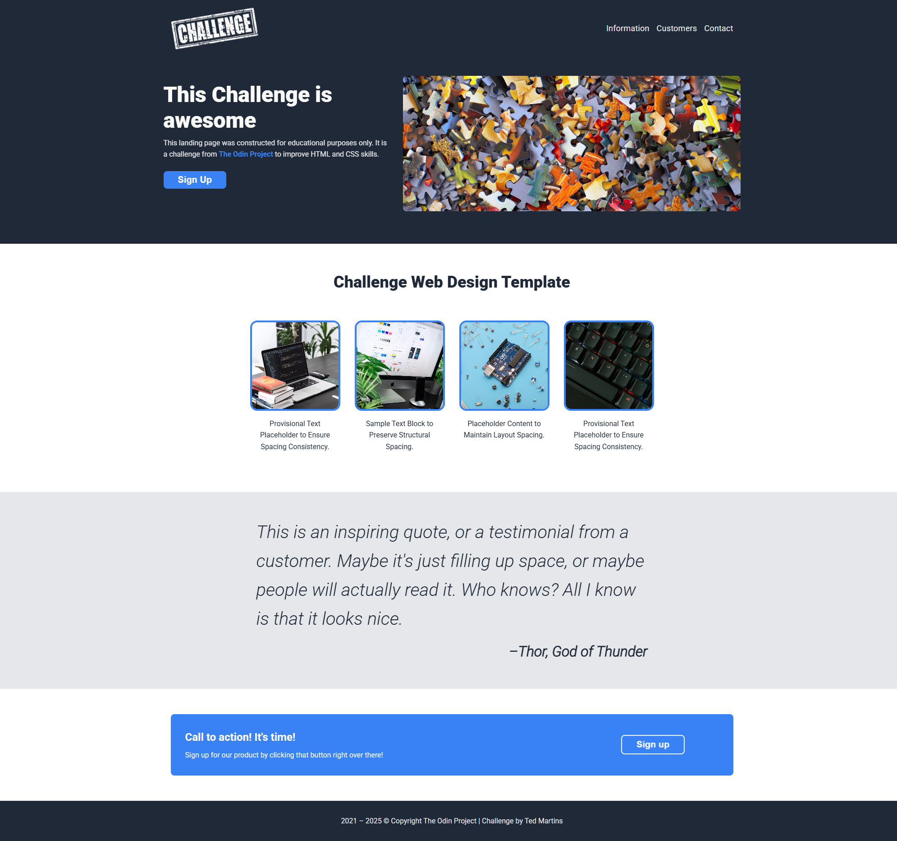

# Landing Page




## Overview

This repository contains my solution for [The Odin Project](https://www.theodinproject.com/) Landing Page challenge. The project demonstrates a landing page built with HTML, CSS, and JavaScript.

## Demo

[Demo](https://tedmartins.github.io/Landing-Page/)
`https://tedmartins.github.io/Landing-Page/`

## Features

- **Responsive Design**: Fully responsive layout that works on mobile, tablet, and desktop devices
- **Modern CSS**: Uses CSS variables, flexbox, and modern styling techniques
- **Interactive Elements**: Added JavaScript functionality beyond the basic requirements
- **Accessibility**: Implemented various accessibility best practices
- **Performance Optimization**: Optimized images and implemented lazy loading

## Enhancements Beyond Requirements

While the original challenge only required HTML and CSS implementation, I've added several enhancements based on my previous experience:

### JavaScript Functionality

- **Notification System**: Created a success notification that appears when clicking the CTA button
- **Interactive Navigation**: Enhanced the navigation with smooth scrolling and hover effects

### Responsive Design

- **Mobile-First Approach**: Ensured the design works seamlessly across all screen sizes
- **Flexible Layouts**: Used flexbox and media queries for adaptive layouts
- **Responsive Typography**: Implemented fluid typography using clamp() for better readability

### Best Practices

- **Semantic HTML**: Used appropriate HTML5 elements for better structure and accessibility
- **CSS Organization**: Structured CSS with comments and logical grouping
- **Code Optimization**: Minimized redundancy with CSS variables and reusable components
- **Performance Considerations**: Added lazy loading for images and optimized resource loading

### Animations

- **CSS Animations**: Implemented some common CSS animations to make things more interesting

## Technologies Used

- HTML5
- CSS3
- JavaScript (ES6+)

## Project Structure

```
Landing-Page/
├── index.html
├── assets/
│   ├── styles/
│   │   └── style.css
│   ├── scripts/
│   │   └── main.js
│   └── imgs/
│       └── challenge.png
└── README.md
```

## Setup and Installation

1. Clone this repository
2. Open `index.html` in your browser

## Acknowledgments

- [The Odin Project](https://www.theodinproject.com/) for the challenge prompt
- [Unsplash](https://unsplash.com/) for the free images used in the project

## License

This project is open source and available under the [MIT License](LICENSE).
